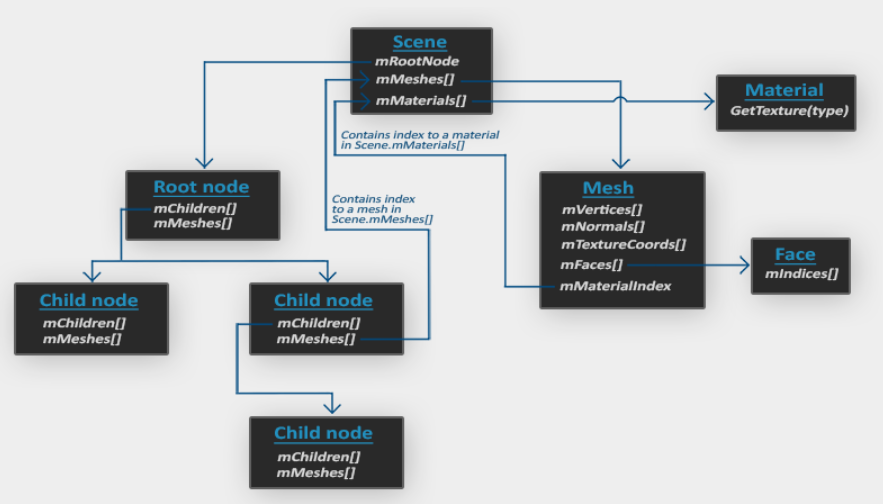

# Loading Models

Docs: https://learnopengl.com/Model-Loading/Assimp

## Model Loading Library
- Popular Model Importing Library: Assimp
	- Assimp stands for **Open Asset Import Library**
- Assimp has the ability to import dozen of different model file formats; and via Assimp's generalized
  data structures, we can retrieve all the data we need.
- 
  - **Scene** Object: All data of the model/scene is contained in the Scene object; everything attaches here.
  - **Root Node**: This may contain child nodes, and could have a set of indices that point to mesh data in the scene object's `mMeshes` array.
    - `mMeshes` array contains the actual Mesh objects, the values in the `mMeshes` array of a node are only indices for the scene's `mMeshes` array.
  - **Mesh** Object: Contains all relevant data needed for rendering. Including vertex positions, normal vectors, texture coordinates, faces, and the material of the object. A mesh contains several faces. The mesh also links to a Material Object
  - **Face**: Represents a render primitive of the object (triangles, squares, points). It contains indices of the vertices that form a primitive; and the indices are separated making it easy for us to render via an index buffer.
  - **Material Object**: This hosts several functions to retrieve the material properties of an object. Think of colors and/or texture maps.

**Basic Premise of Loading a Model**

- First load an object into a Scene Object.
- Recursively retrieve the corresponding Mesh Objects from each node
- Process each Mesh object to retrieve the vertex data and material properties
- The result is what we will take and store into a single `Model` Object.

**Downloading Assimp**

1. Download and extract the Assimp source code zip from https://github.com/assimp/assimp/tree/master
2. Open PowerShell in the folder and type `cmake .\CMakeLists.txt`
3. Then in the folder open `Assimp.sln` and when VS opens select your build config debug or release.
4. Then select Build and select `Build Solution`
5. After building is complete, go into the lib folder and open the folder either debug or release depending on your build config, 
6. Follow the rest of this video to put the stuff in: https://youtu.be/oci7xJEg6sU
7. 
